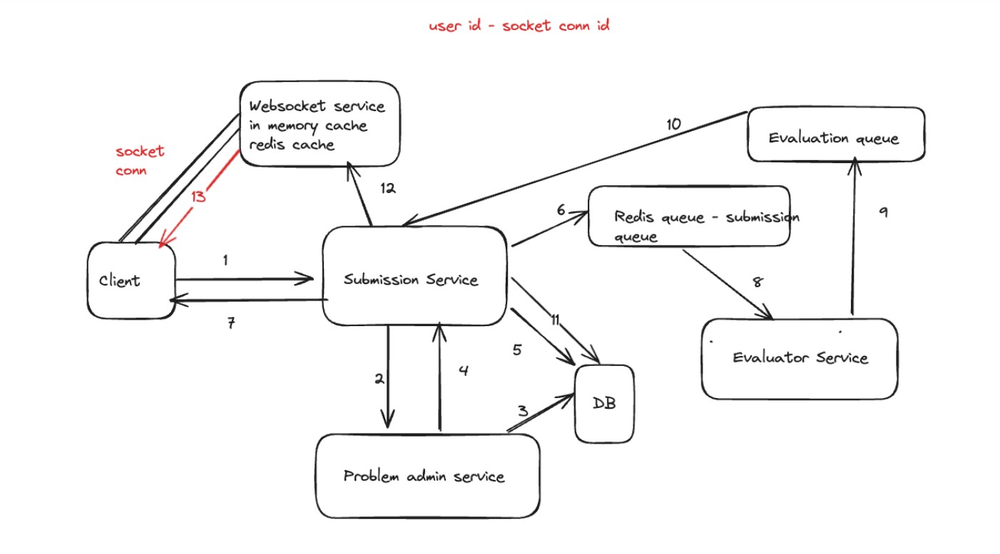

## AlgoCraft Backend Flow

### Overview
This system designed to handle the Problem creation, code submission, evaluations and notifies the execution status.

### System Flow
1. **Client Sends Request:** A client submits a code for evaluation.
2. **Submission Service:**
   * Receives the submission request.
   * Fetches problem details from the Problem Admin Service.
   * Stores submission details in the database.
   * Enqueues the submission payload in a Redis queue.
   * Sends a confirmation response to the client.
3. **Evaluator Service:**
   * Consumes the submission from the Redis queue.
   * Evaluates the code based on test cases.
   * Enqueues the evaluation result in another Redis queue.
4. **Submission Service:**
   * Consumes the evaluation result.
   * Updates submission details in the database.
   * Notifies the WebSocket service about the status.
5. **WebSocket Service:**
   * Sends real-time updates to the client about the code execution status.

### Components
* **Problem Admin Service:** Manages problem details.
* **Submission Service:** Handles submission creation, queuing, and updates.
* **Evaluator Service:** Evaluates submitted code.
* **WebSocket Service:** Provides real-time updates.

### Technologies
* **Problem Admin Service:** JavaScript, ExpressJS, MongoDB
* **Submission Service:** JavaScript, Fastify, Redis(queue), MongoDB
* **Evaluator Service:** TypeScript, ExpressJS, Redis(queue)
* **WebSocket:** socket.io, Redis(cache)
